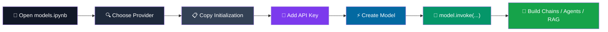

<div align="center">

# ⚡ Free API Keys Models

### 🚀 The fastest way to start building with free-tier LLM APIs using LangChain


<br>


<br><br>

[📓 Notebook](#-how-it-works) •
[⚡ Providers](#-providers-covered) •
[🚀 Quick Start](#-quick-start) •
[🔑 API Keys](#-where-to-get-free-api-keys) •
[🗺️ Roadmap](#️-roadmap)

</div>

---

## 🧠 What Is This?

**Free API Keys Models** is a practical reference repository centered around one notebook:

```text
models.ipynb
```

It contains the **minimal LangChain initialization code** for five LLM providers offering usable free API tiers.

No:

* ❌ SDK hunting
* ❌ complicated boilerplate
* ❌ half-finished quickstarts
* ❌ unnecessary abstractions
* ❌ marketing filler

Just:

```text
Provider
   ↓
Import
   ↓
Model class
   ↓
Model name
   ↓
API key
   ↓
model.invoke(...)
```

The goal is simple:

> **Pick a provider → copy the initialization → add your API key → start building.**

---

## ✨ Why This Repository?

When experimenting with LLM applications, changing providers shouldn't mean rewriting your entire application.

This repository demonstrates how different providers can expose a consistent LangChain model interface:

```text
┌──────────────────────────────────────────┐
│             Your AI Application          │
├──────────────────────────────────────────┤
│       Chains • Agents • RAG • Tools      │
├──────────────────────────────────────────┤
│              LangChain API               │
├──────────────────────────────────────────┤
│                                          │
│  Mistral   Groq   OpenRouter   Qwen      │
│                       │          │       │
│                   Ollama Cloud           │
│                                          │
└──────────────────────────────────────────┘
```

Change the provider.

**Your downstream LangChain code can remain essentially the same.**

---

# 🧭 How It Works



### The workflow

```text
📓 Open notebook
      ↓
🔍 Pick provider
      ↓
📋 Copy code
      ↓
🔐 Configure .env
      ↓
⚡ Invoke model
      ↓
🤖 Build your application
```

---

# ⚡ Providers Covered

<div align="center">

|       Provider      |             Model            |    LangChain Package   |     Connection    |
| :-----------------: | :--------------------------: | :--------------------: | :---------------: |
|  🌬️ **Mistral AI** |    `mistral-medium-latest`   |  `langchain-mistralai` |       Native      |
|      ⚡ **Groq**     |   `openai/gpt-oss-120b`  |    `langchain-groq`    |       Native      |
|  🔀 **OpenRouter**  | `google/gemma-4-31b-it:free` | `langchain-openrouter` |       Native      |
|     🌐 **Qwen**     |         `qwen-turbo`         |   `langchain-openai`   | OpenAI-compatible |
| 🦙 **Ollama Cloud** |         `gpt-oss:20b`        |   `langchain-openai`   | OpenAI-compatible |

</div>

---

## 🌬️ Mistral AI

```text
Model
└── mistral-medium-latest

Package
└── langchain-mistralai

Authentication
└── Native API key
```

A straightforward LangChain integration using Mistral's native package.

---

## ⚡ Groq

```text
Model
└── openai/gpt-oss-120b

Package
└── langchain-groq

Authentication
└── Native API key

Highlight
└── ⚡ Extremely fast inference
```

---

## 🔀 OpenRouter

```text
Model
└── google/gemma-4-31b-it:free

Package
└── langchain-openrouter

Authentication
└── Native API key

Highlight
└── 🔀 Access to free-tagged models
```

---

## 🌐 Qwen — Alibaba DashScope Intl

```text
Model
└── qwen-turbo

Package
└── langchain-openai

Protocol
└── OpenAI-compatible API

Base URL
└── https://dashscope-intl.aliyuncs.com/compatible-mode/v1
```

---

## 🦙 Ollama Cloud

```text
Model
└── gpt-oss:20b

Package
└── langchain-openai

Protocol
└── OpenAI-compatible API
```

---

# 🛠️ Tech Stack

<div align="center">


<br>


</div>

---

# 🚀 Quick Start

## 1️⃣ Clone the Repository

```bash
git clone https://github.com/SalikAhmad702/Free-API-Keys-Models.git

cd Free-API-Keys-Models
```

---

## 2️⃣ Create a Virtual Environment

### Windows

```bash
python -m venv venv

venv\Scripts\activate
```

### macOS / Linux

```bash
python -m venv venv

source venv/bin/activate
```

---

## 3️⃣ Install Dependencies

### Using `pip`

```bash
pip install -r requirements.txt
```

### Using `uv` ⚡

```bash
uv pip install -r requirements.txt
```

### Install Individual Providers

If you only need one provider:

```bash
uv pip install langchain-mistralai
uv pip install langchain-groq
uv pip install langchain-openrouter
uv pip install langchain-openai
```

Each provider section inside the notebook also contains its corresponding `uv pip install` command.

---

# 🔐 Environment Configuration

Create your environment file:

```bash
cp .env.example .env
```

Then add the API keys for the providers you want to use.

```env
MISTRAL_API_KEY=your_key_here
GROQ_API_KEY=your_key_here
OPENROUTER_API_KEY=your_key_here
QWEN_API_KEY=your_key_here
OLLAMA_API_KEY=your_key_here
```

> ⚠️ **Never commit your real `.env` file to GitHub.**

Only configure the providers you actually plan to use.

---

# 📓 Launch the Notebook

```bash
jupyter notebook models.ipynb
```

Then:

```text
📓 models.ipynb
       │
       ├── 🌬️ Mistral
       ├── ⚡ Groq
       ├── 🔀 OpenRouter
       ├── 🌐 Qwen
       └── 🦙 Ollama Cloud
```

Choose a provider and run its self-contained code cell.

---

# 🧩 The Core Pattern

Every provider follows the same fundamental idea.

### Example — Groq

```python
from langchain_groq import ChatGroq

model = ChatGroq(
    model="openai/gpt-oss-120b"
)

response = model.invoke(
    "Explain RAG in one sentence."
)

print(response.content)
```

The important part is the consistent interface:

```python
model.invoke(...)
```

That means your application can continue using the same LangChain abstractions for:

```text
                    ┌──────────────┐
                    │    Model     │
                    └──────┬───────┘
                           │
          ┌────────────────┼────────────────┐
          ↓                ↓                ↓
       Chains            Agents            RAG
          │                │                │
          └────────────────┼────────────────┘
                           ↓
                    AI Application
```

---

# 🌐 OpenAI-Compatible Providers

Qwen and Ollama Cloud use an OpenAI-compatible interface.

For example:

```python
from langchain_openai import ChatOpenAI
import os

model = ChatOpenAI(
    model="qwen-turbo",
    api_key=os.getenv("QWEN_API_KEY"),
    base_url="https://dashscope-intl.aliyuncs.com/compatible-mode/v1",
)
```

```python
from langchain_openai import ChatOpenAI
import os

model = ChatOpenAI(
    model="minimax-m3:cloud",
    api_key=os.getenv("OLLAMA_API_KEY"),
    base_url="https://ollama.com/v1",
)
```

The provider changes.

The rest of your LangChain architecture doesn't need to.

---

# 🔄 Provider Swapping

Think of the model as a replaceable component:

```text
                    YOUR APPLICATION
                           │
                           ▼
                  ┌─────────────────┐
                  │    LangChain    │
                  └────────┬────────┘
                           │
                    model.invoke()
                           │
              ┌────────────┼────────────┐
              │            │            │
              ▼            ▼            ▼
           Mistral        Groq      OpenRouter
              │            │            │
              └────────────┼────────────┘
                           │
                    Same application
```

This makes experimentation much easier when testing different providers.

---

# 🔑 Where to Get Free API Keys

| Provider                 | Console                                                                         |
| :----------------------- | :------------------------------------------------------------------------------ |
| 🌬️ Mistral AI           | [console.mistral.ai](https://console.mistral.ai/)                               |
| ⚡ Groq                   | [console.groq.com/keys](https://console.groq.com/keys)                          |
| 🔀 OpenRouter            | [openrouter.ai/keys](https://openrouter.ai/keys)                                |
| 🌐 Qwen — DashScope Intl | [dashscope-intl.console.aliyun.com](https://dashscope-intl.console.aliyun.com/) |
| 🦙 Ollama Cloud          | [ollama.com](https://ollama.com/)                                               |

> **Note:** Free-tier availability, quotas, model access, and rate limits can change. Check each provider's current console before relying on a model in production.

---

# 📁 Repository Structure

```text
Free-API-Keys-Models/
│
├── 📓 models.ipynb
│   └── Provider initialization examples
│
├── 🔐 .env.example
│   └── API key template
│
├── 📦 requirements.txt
│   └── Dependencies for all providers
│
└── 📖 README.md
    └── Project documentation
```

### Notebook philosophy

```text
One provider
     ↓
One markdown heading
     ↓
One self-contained code cell
     ↓
Copy → Paste → Run
```

---

# 🗺️ Roadmap

### Current

* [x] 🌬️ Mistral AI
* [x] ⚡ Groq
* [x] 🔀 OpenRouter
* [x] 🌐 Qwen
* [x] 🦙 Ollama Cloud

### Planned

* [ ] 🔵 Google Gemini free tier
* [ ] 🌊 Streaming response examples
* [ ] ⚡ Latency benchmark
* [ ] 🧠 Quality benchmark
* [ ] 📊 Compare all five providers automatically

### Future Vision

```text
Free API Reference
       │
       ├── Providers
       ├── Models
       ├── Streaming
       ├── Structured Output
       ├── Tool Calling
       ├── RAG
       ├── Agents
       └── Benchmarks
```

---

# 🤝 Contributing

Found another provider with a **real free tier**?

Add it using the same philosophy:

```text
1 Provider
1 Markdown section
1 Self-contained code cell
1 Clear model name
```

### Create a branch

```bash
git checkout -b add/provider-name
```

### Commit your changes

```bash
git commit -m "feat: add <provider> setup"
```

### Push

```bash
git push origin add/provider-name
```

Then open a Pull Request.

---

# ⭐ Support the Project

If this repository saved you time searching through provider documentation:

<div align="center">

### ⭐ Star the repository

### 🔁 Share it with another AI/ML developer

### 🛠️ Contribute another free-tier provider

</div>

---

# 👤 Author

<div align="center">

## **Salik Ahmad**

### AI/ML Engineer


<br>

**Building agentic AI systems, RAG pipelines, and LLM-powered tools — one free API key at a time.**

</div>

---

<div align="center">

### 🚀 Build more. Pay less. Experiment faster.

<br>


<br><br>

**© 2026 Salik Ahmad · AI/ML Engineer**

</div>
