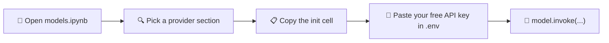

<div align="center">


<p>
  
  
  
  
  
</p>

<p>
  
</p>

</div>

<br/>

## 📌 Overview

**Free API Keys Models** is a single reference notebook (`models.ipynb`) that shows the *exact, minimal* LangChain initialization code for five LLM providers that offer genuinely usable **free API tiers**. No SDK-hunting, no half-finished quickstarts, no marketing filler — just the import, the class, and the model string for each provider, ready to copy and run.

Every provider initializes the same `model` object shape, so once you pick one, everything downstream — chains, agents, RAG pipelines — stays identical.

<br/>

## 🧭 How It Works



<br/>

## ⚡ Providers Covered

<table>
<tr>
<td width="50%" valign="top">

### 🌬️ Mistral AI
`mistral-medium-latest`
via `langchain-mistralai`
Native key auth

### ⚡ Groq
`llama-3.3-70b-versatile`
via `langchain-groq`
Native key auth — blazing inference speed

</td>
<td width="50%" valign="top">

### 🔀 OpenRouter
`google/gemma-4-31b-it:free`
via `langchain-openrouter`
Native key auth — free-tagged models

### 🌐 Qwen (Alibaba DashScope Intl)
`qwen-turbo`
via `langchain-openai` (OpenAI-compatible)

</td>
</tr>
</table>

<div align="center">

### 🦙 Ollama Cloud
`gpt-oss:20b` · via `langchain-openai` (OpenAI-compatible)

</div>

<br/>

## 🛠️ Tech Stack

<p>
  
  
  
  
  
  
  
  
</p>

<br/>

## 🚀 Quick Start

**1. Clone the repo**
```bash
git clone https://github.com/SalikAhmad702/Free-API-Keys-Models.git
cd Free-API-Keys-Models
```

**2. Create a virtual environment**
```bash
python -m venv venv

# Windows
venv\Scripts\activate
# macOS/Linux
source venv/bin/activate
```

**3. Install dependencies**

Using `pip`:
```bash
pip install -r requirements.txt
```

Or using `uv` (faster):
```bash
uv pip install -r requirements.txt
```

Each provider cell in the notebook also has its own `uv pip install` line commented above it, if you only want to install one provider's package:
```bash
uv pip install langchain-mistralai
uv pip install langchain-groq
uv pip install langchain-openrouter
uv pip install langchain-openai
```

**4. Set up your keys**
```bash
cp .env.example .env
```
Open `.env` and paste in your real API keys — you only need the ones you plan to use.

**5. Launch the notebook**
```bash
jupyter notebook models.ipynb
```
Run the cell under whichever provider heading you want. Each block is fully self-contained.

<br/>

## 🧩 The Pattern

Every provider reduces to the same three lines:

```python
from langchain_groq import ChatGroq

model = ChatGroq(model="llama-3.3-70b-versatile")
response = model.invoke("Explain RAG in one sentence.")
print(response.content)
```

For OpenAI-compatible providers (Qwen, Ollama Cloud), the only difference is a `base_url`:

```python
from langchain_openai import ChatOpenAI
import os

model = ChatOpenAI(
    model="qwen-turbo",
    api_key=os.getenv("QWEN_API_KEY"),
    base_url="https://dashscope-intl.aliyuncs.com/compatible-mode/v1",
)
```

Swap the class, swap the provider — your chains, prompts, and agents never need to change.

<br/>

## 🔐 Where to Get Free API Keys

| Provider | Console |
|---|---|
| 🌬️ Mistral AI | [console.mistral.ai](https://console.mistral.ai/) |
| ⚡ Groq | [console.groq.com/keys](https://console.groq.com/keys) |
| 🔀 OpenRouter | [openrouter.ai/keys](https://openrouter.ai/keys) |
| 🌐 Qwen (DashScope Intl) | [dashscope-intl.console.aliyun.com](https://dashscope-intl.console.aliyun.com/) |
| 🦙 Ollama Cloud | [ollama.com](https://ollama.com/) |

<br/>

## 📁 Repository Structure

```
Free-API-Keys-Models/
├── models.ipynb         # One markdown header + one code cell per provider
├── .env.example          # Key template — copy to .env and fill in
├── requirements.txt       # Everything needed to run every cell
└── README.md
```

<br/>

## 🗺️ Roadmap

- [x] Mistral, Groq, OpenRouter, Qwen, Ollama Cloud
- [ ] Google Gemini free tier
- [ ] Streaming response examples per provider
- [ ] Latency + quality benchmark script across all five

<br/>

## 🤝 Contributing

Found another provider with a real free tier? Add it in the same format — one markdown header, one self-contained code cell — and open a PR.

```bash
git checkout -b add/provider-name
git commit -m "feat: add <provider> setup"
git push origin add/provider-name
```

<br/>

---

<div align="center">

## 👤 Author

### **Salik Ahmad**
**AI/ML Engineer**

*Building agentic AI systems, RAG pipelines, and LLM-powered tools — one free API key at a time.*

<p>
  <a href="https://salikahmad.vercel.app/" target="_blank">
    
  </a>
  <a href="https://www.linkedin.com/in/salik-ahmad-programmer/" target="_blank">
    
  </a>
  <a href="https://github.com/SalikAhmad702" target="_blank">
    
  </a>
  <a href="https://www.kaggle.com/salikahmad702" target="_blank">
    
  </a>
</p>

<br/>

<sub>⭐ If this saved you an hour of digging through provider docs, consider starring the repo.</sub>

<br/><br/>

---

<sub>© 2026 Salik Ahmad · AI/ML Engineer</sub>

</div>
